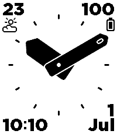
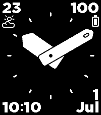

# Nyquist

Pebble analog watchface with bold geometric hands, weather, battery, and date.

| Time 2, white                                      | Time 2, black                                        | Round 2, white                                       | Round 2, black                                         |
|----------------------------------------------------|------------------------------------------------------|------------------------------------------------------|--------------------------------------------------------|
|  |  |  |  | 

### Makefile

The project uses a _Makefile_ for common routines (build, install, emulator logs,
and screenshot capture helpers for Emery and Gabbro).

### Platforms

The watchface targets:

- Emery (Pebble Time 2)
- Gabbro (Pebble Round 2)

On Gabbro, corner elements are never shown so the clock fills the round display
cleanly.

### Configuration

Settings are managed from the Pebble phone app config page. Available options:

- Show/hide corner elements (Emery only)
- Invert black/white colors
- Time format: 24h or 12h am/pm
- Temperature unit: Celsius or Fahrenheit

### Weather data

Phone-side JavaScript fetches weather data and sends updates to the watch via
AppMessage. The watchface displays current temperature and weather icon when
available.

Data sources:

- Finnish Meteorological Institute (FMI) if you're in Finland or nearby
- Open-Meteo elsewhere
